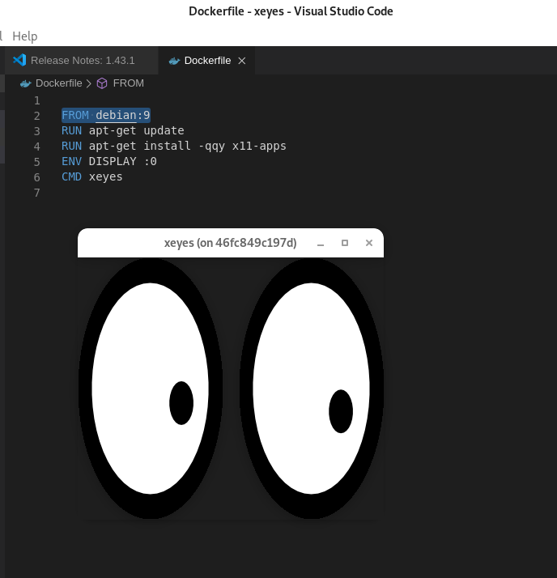

# README

Container demonstrating how to run a GUI application like `xeyes`.

Source: https://stackoverflow.com/a/25280523/5270873

Build the image:

```
docker build -t xeyes .
```

Before running the container, set `X` variables first in the host:
```
 # Run these in the host machine
 XSOCK=/tmp/.X11-unix
 XAUTH=/tmp/.docker.xauth
 xauth nlist :0 | sed -e 's/^..../ffff/' | xauth -f $XAUTH nmerge -
```

Run the container from the terminal:
 ```
 docker run -ti -v $XSOCK:$XSOCK -v $XAUTH:$XAUTH -e XAUTHORITY=$XAUTH xeyes
 ```


**Note**

The `debian:latest` tag will always point the latest stable release (which is, at the time of this writing, `debian:buster`). Stable releases are also tagged with their version (ie, `debian:9` is an alias for `debian:stretch`, `debian:8` is an alias for `debian:jessie`, etc).

In this example we choose to build an image from Debian 9:

```
FROM debian:9
```


The output is an `x` window with `xeyes:`

